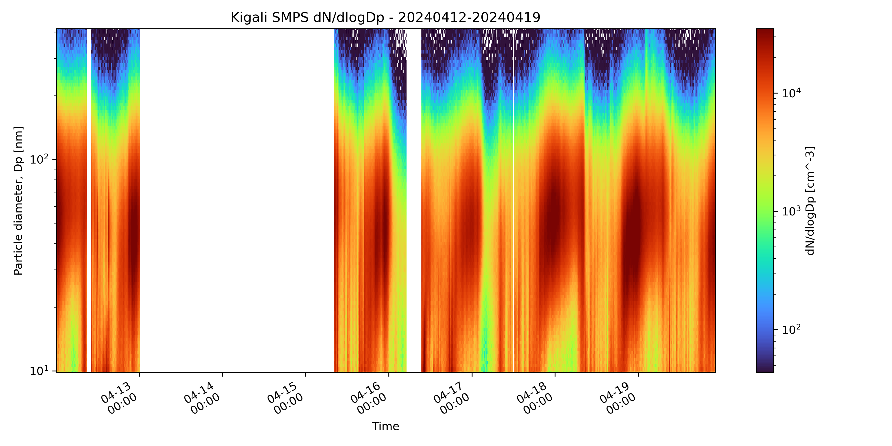
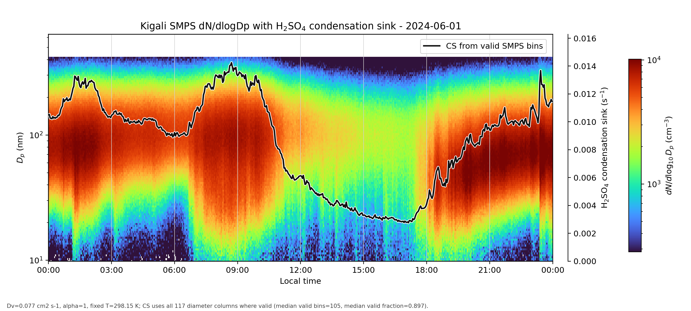
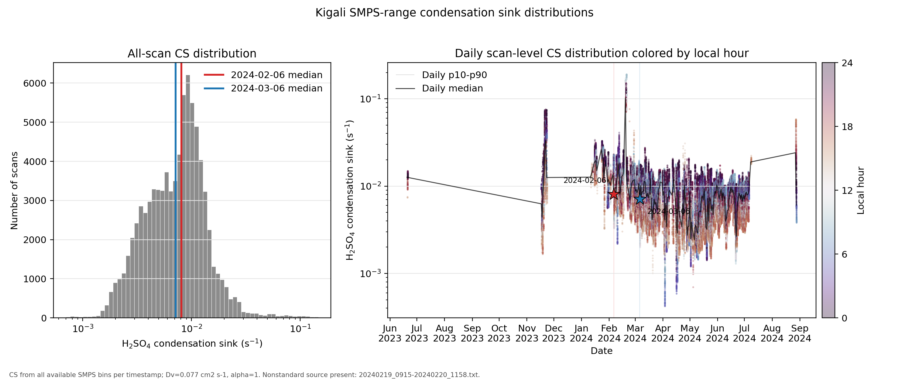
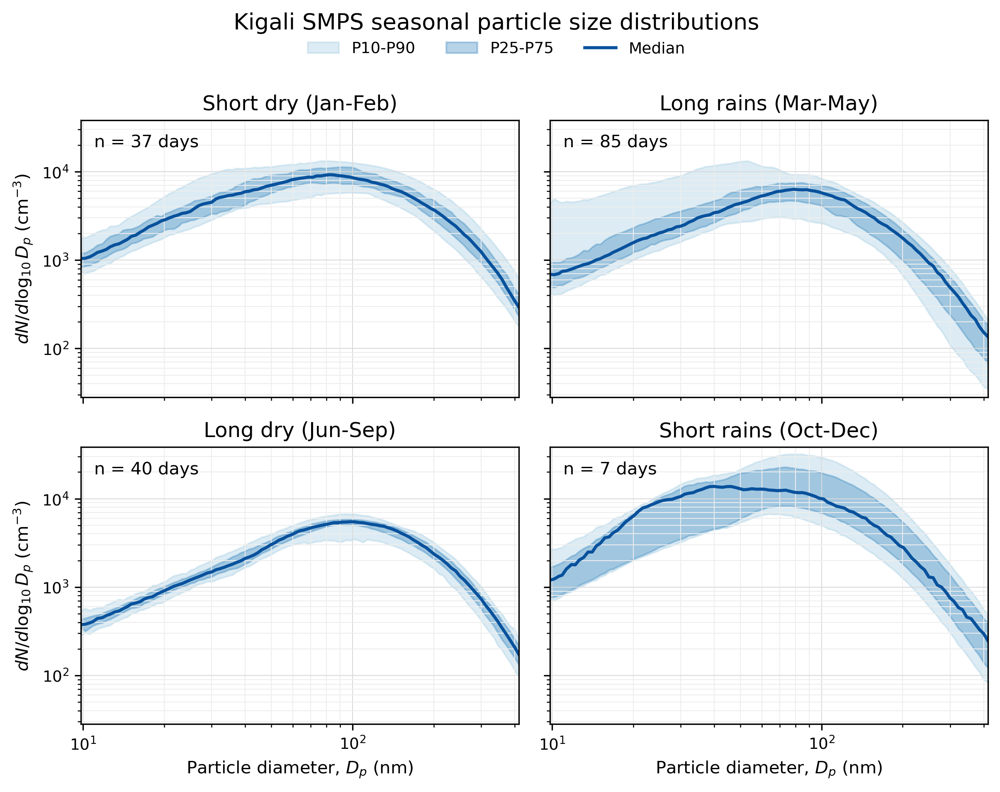
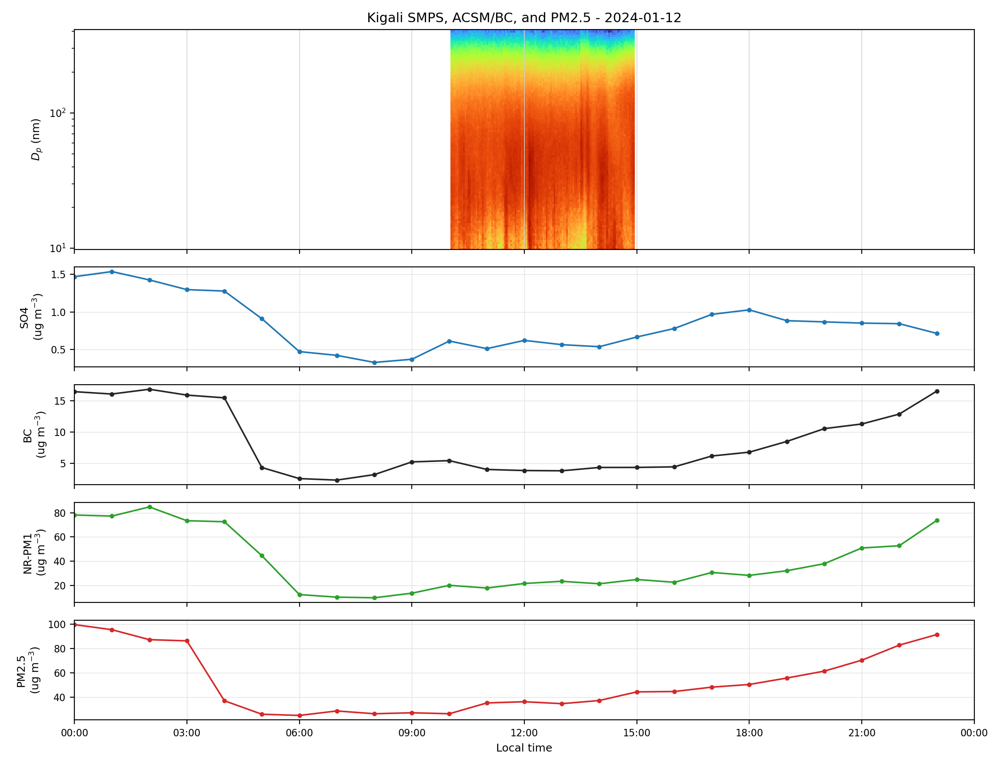

# smps-plot

Code-only Kigali SMPS particle size distribution plotting and analysis workflow.

This repository keeps the Python and PowerShell scripts used to process, plot, and analyze SMPS particle size distribution data. Raw instrument files, selected AIM exports, merged data tables, generated figures, and supporting PM/met data are intentionally not tracked in GitHub.

The scripts expect data to be available locally in the Kigali working folder or supplied through command-line paths. A small set of derived PNG figures is tracked in `examples/` so the repository shows the expected outputs without publishing the raw measurement files.

## What the SMPS Measures

An SMPS, or Scanning Mobility Particle Sizer, measures the particle number size distribution of an aerosol. In a typical SMPS system, particles are first brought to a known charge distribution, then passed through a Differential Mobility Analyzer. The DMA selects particles by electrical mobility, which is related to particle diameter. A Condensation Particle Counter then counts the selected particles. By scanning across mobility settings, the instrument reconstructs how many particles are present at each particle size.

The main output used here is `dN/dlogDp` in units of `cm^-3`: the particle number concentration normalized by logarithmic particle diameter bin. The plots in this repository focus on mobility-equivalent particle diameter, usually from roughly 10 nm to a few hundred nm, and show how the particle size distribution changes through time. SMPS data do not directly measure particle chemical composition or mass, so the comparison workflow adds separate ACSM/BC and PM2.5 measurements when those local files are available.

Several scripts also calculate a sulfuric-acid condensation sink from the measured size distribution. This estimates how rapidly H2SO4 vapor would be lost to the aerosol surface area represented by the SMPS bins. It is useful for new-particle-formation and growth analysis because a larger condensation sink can suppress vapor availability for nucleation and growth.

## Repository Layout

| Path | What it contains |
| --- | --- |
| `tools/` | Main curated Kigali SMPS processing and plotting scripts. |
| Root legacy `*.py` scripts | Original scripts that were already present in the GitHub repository before this cleanup. |
| `external_scripts/smps_python_code/` | Legacy and comparison scripts copied from `D:\Documents\PhD-Research\SMPS python code`. |
| `external_scripts/smps_comparison/` | Related scripts copied from `D:\Documents\PhD-Research\SMPS Comparison`. |
| `examples/` | Small derived PNG examples of the main plot types. No raw data files are included. |
| `requirements.txt` | Python packages used by the plotting and analysis scripts. |

## Main Scripts

| Script | Purpose |
| --- | --- |
| `tools/merge_aim_txt_exports.py` | Merges AIM SMPS tab-delimited exports into long, wide, and scan-summary CSV files. |
| `tools/plot_daily_smps_from_master.py` | Builds time-ordered master SMPS files and daily 24-hour dN/dlogDp contour plots. |
| `tools/plot_smps_contour.py` | Plots dN/dlogDp contours and average PSD curves for one or more AIM text exports. |
| `tools/analyze_smps_psd_basic.py` | Computes PSD-only scan metrics, daily summaries, size-range metrics, and methods notes from a merged wide file. |
| `tools/plot_kigali_smps_baseline_psd.py` | Creates campaign-average, seasonal, and diurnal baseline PSD visualizations. |
| `tools/batch_smps_acsm_pm25_daily.py` | Runs the daily Kigali SMPS, ACSM/BC, PM2.5, condensation sink, and candidate-event comparison workflow. |
| `tools/plot_contour_cs_example.py` | Makes a single-day SMPS contour with sulfuric-acid condensation-sink overlay. |
| `tools/plot_cs_distribution.py` | Summarizes and plots campaign condensation-sink distributions from daily contour outputs. |
| `tools/rename_aim_txt_by_time.py` | Renames AIM exports using the first and last scan timestamps inside each file. |
| `tools/make_aim_inventory.ps1` | PowerShell helper for inventorying AIM instrument/export files. |

## External Script Archive

The `external_scripts/` folder keeps earlier scripts used for PSD plotting, contour plotting, Rwanda/Kigali time series, ACSM-SMPS comparison, and other SMPS sites. These scripts are preserved for traceability and reuse, but the `tools/` folder is the curated Kigali workflow.

## Example Outputs

### SMPS contour plot

This plot shows the time evolution of the particle size distribution. The x-axis is local time, the y-axis is particle diameter, and the color scale is `dN/dlogDp`.



### Contour with condensation sink

This plot overlays the H2SO4 condensation sink calculated from the valid SMPS size bins on top of the particle size distribution contour.



### Condensation sink distribution

This summary figure shows the campaign-level distribution of calculated condensation sink values and daily scan-level behavior colored by local hour.



### Seasonal PSD summary

This plot summarizes median seasonal particle size distributions with quantile envelopes.



### Supporting data comparison plot

When local ACSM/BC and PM2.5 files are available, the batch workflow combines those measurements with the SMPS contour for day-level comparison.



## Quick Start

Create an environment and install the plotting stack:

```powershell
python -m venv .venv
.\.venv\Scripts\Activate.ps1
pip install -r requirements.txt
```

Example workflow using local, untracked data folders:

```powershell
python tools\merge_aim_txt_exports.py "final files selected" --out "merged outputs\master_all_processed"
python tools\plot_daily_smps_from_master.py --wide "merged outputs\master_all_processed\smps_merged_wide.csv" --summary "merged outputs\master_all_processed\smps_scan_summary.csv" --out "merged outputs\master_all_processed"
python tools\analyze_smps_psd_basic.py --input "merged outputs\master_all_processed\smps_master_wide_time_ordered.csv" --out "outputs\psd_basic_analysis"
python tools\plot_kigali_smps_baseline_psd.py --raw-wide "merged outputs\master_all_processed\smps_master_wide_time_ordered.csv" --summary-dir "outputs\psd_basic_analysis" --output-dir "outputs\psd_basic_analysis"
```

Make a contour plot directly from AIM text exports:

```powershell
python tools\plot_smps_contour.py "final files selected" --start 20240412 --end 20240419 --label 20240412_20240419 --out "figures\smps_contour_tests"
```

Make a single-day SMPS contour with calculated H2SO4 condensation sink:

```powershell
python tools\plot_contour_cs_example.py --day 2024-06-01 --smps-wide "merged outputs\master_all_processed\smps_master_wide_time_ordered.csv" --output "outputs\smps_acsm_pm25_batch\08_contour_CS"
```

Summarize campaign condensation sink calculations:

```powershell
python tools\plot_cs_distribution.py "outputs\smps_acsm_pm25_batch\08_contour_CS" --output "outputs\smps_acsm_pm25_batch\09_cs_distribution"
```

Run the daily SMPS + ACSM/BC + PM2.5 workflow:

```powershell
python tools\batch_smps_acsm_pm25_daily.py --smps-wide "merged outputs\master_all_processed\smps_master_wide_time_ordered.csv" --smps-metrics "outputs\psd_basic_analysis\smps_psd_scan_metrics.csv" --acsm "other data\PM_component_no_PMF_with_NA.csv" --pm25 "other data\Kigali_US_Emabassy_PM2.5_T640.csv" --output "outputs\smps_acsm_pm25_batch"
```

## Data Policy

This repository is code-only. The following local folders and file types are ignored:

- Raw SMPS/AIM files: `*.S80`, `*.p80`, `*.p72`
- Selected text exports: `final files selected/`
- Processed products: `merged outputs/`, `outputs/`
- Generated working figures: `figures/`
- Selected derived example figures: `examples/`
- Supporting local data: `met data/`, `other data/`

Keep those data products locally, in an institutional storage location, or in a separate data release if needed.
